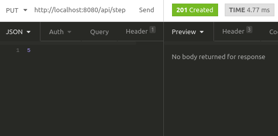
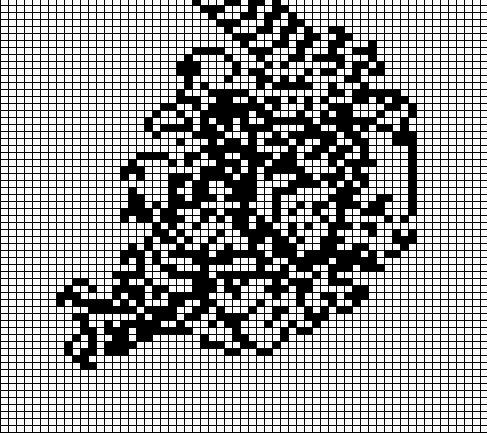

# The grid machine

Consider an infinite grid of white and black squares. The grid is initially all white and there is a machine in one cell facing right. It will move based on the following rules:

* If the machine is in a white square, turn 90° clockwise and move forward 1 unit;
* If the machine is in a black square, turn 90° counter-clockwise and move forward 1 unit;
* At every move, flip the color of the base square.

This web application will receive HTTP PUT requests with a number of steps the simulation should run, always starting from the same conditions, and output the resulting grid to a file.

__Table of content__

- [Prerequisites](#prerequisites)

- [Installation](#installation)

- [Usage](#usage)

- [Possible improvements](#possible-improvements)

### Prerequisites

* [Docker](https://docs.docker.com/)
* [Docker-compose](https://docs.docker.com/compose/)
* Any http client such as [postman](https://www.getpostman.com/) or [insomnia](https://insomnia.rest/)

### Installation

First, make sure your port 8080 is not already in use, otherwise, you can change the port to use in the docker-compose configuration file.

To run the project, simply execute the following command in your terminal (Linux). Depending on your docker installation, it may require administrator privileges.

```bash
docker-compose up --build
```

### Usage

Using your HTTP client, send a PUT request to http://localhost:8080/api/step with a JSON body containing only the number of steps to execute.

When the file is created, the API returns an empty 201 (created) response.

The file will be outputted in the "output" directory.



Sample result for 60000 steps:



### Possible improvements

* Add Windows installation documentation
* Add multiple output file types
* Allow displaying the machine on the grid
